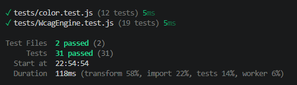

# Test Report

## Summary

The `wcag-engine` module is verified with automated unit tests written in vitest. Tests cover the public API of the `WcagEngine` class and the standalone color utilities. Run all tests locally with `npm test`.

## Results

| What                                                                    | How                                                                                                 | Result |
| ----------------------------------------------------------------------- | --------------------------------------------------------------------------------------------------- | ------ |
| `hexToRgb` converts valid hex to RGB values                             | Unit tests with lowercase, uppercase, black, and white                                              | Passed |
| `hexToRgb` throws on invalid hex format                                 | Unit test with non-hex string                                                                       | Passed |
| `linearize` returns correct linear values                               | Unit tests at boundaries (`[0,0,0]`, `[255,255,255]`) and mid-range (`[128,128,128]`)               | Passed |
| `relativeLuminance` returns 0 for black, 1 for white                    | Unit tests for linear RGB boundaries                                                                | Passed |
| `contrastRatio` returns maximum for black on white                      | Unit test comparing luminance 0 and 1                                                               | Passed |
| `contrastRatio` returns 1 for identical colors                          | Unit test with equal luminance values                                                               | Passed |
| `contrastRatio` argument order does not matter                          | Unit test comparing both argument orders                                                            | Passed |
| `WcagEngine.checkContrast` returns correct ratio and pass/fail for text | Unit tests with black on white, gray on white (passes AA, fails AAA), and light gray (fails both)   | Passed |
| `WcagEngine.checkContrast` handles large text via font size             | Unit test with 24px text at borderline ratio                                                        | Passed |
| `WcagEngine.checkContrast` handles large text via font weight           | Unit test with 19px bold text at borderline ratio                                                   | Passed |
| `WcagEngine.checkContrast` validates font size and weight               | Unit tests with negative values throwing errors                                                     | Passed |
| `WcagEngine.checkNonTextContrast` uses 3:1 threshold                    | Unit tests with black on white, gray on white (passes at 3:1), and light gray (fails)               | Passed |
| `WcagEngine.checkTargetSize` reports pass/fail for dimensions           | Unit tests at 44x44 (both pass), 30x30 (AA only), 20x20 (both fail), and 44x20 (only one dimension) | Passed |
| `WcagEngine.checkTargetSize` throws on invalid dimensions               | Unit test with negative values                                                                      | Passed |
| `WcagEngine.conformanceLevel` defaults to AA                            | Unit test on default instance                                                                       | Passed |
| `WcagEngine.conformanceLevel` throws on invalid value                   | Unit test with `'B'`                                                                                | Passed |
| `WcagEngine.passes` reflects configured conformance level               | Unit tests verifying `passes` matches `aa` at AA and `aaa` at AAA                                   | Passed |
